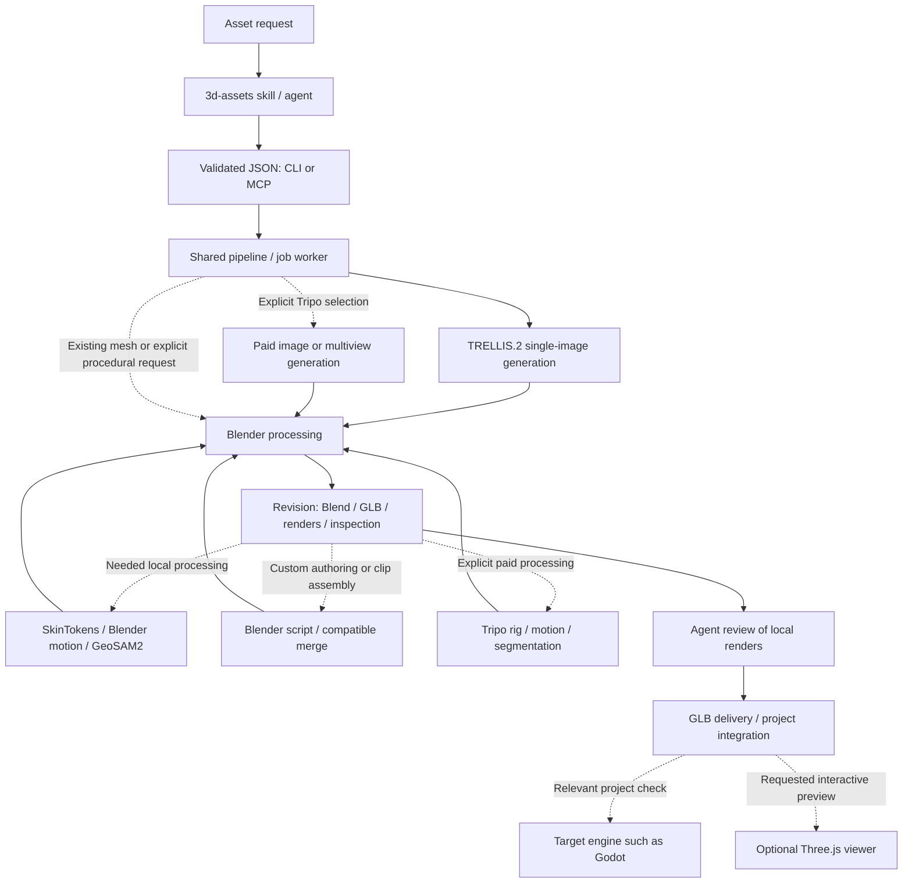

# Architecture and data flow

[한국어](ARCHITECTURE.md) | **English**

The agent prepares references, chooses the workflow and inspects actual results. The runtime executes validated JSON through default TRELLIS.2 or explicitly selected Tripo, followed by Blender processing. Reviewed GLB/source files are the default delivery; engines and interactive viewers are optional.

Generation does not choose editing. Static geometry, object motion, existing rigs, SkinTokens drafts, custom scripts and clip merging are independent choices. `process` supplies learned rigging/segmentation and procedural motion; `blender-edit`/`merge-animations` use installed Blender. Preserve generation and processing provenance separately.



## Implementation map

| Location | Responsibility |
| --- | --- |
| [Skill](../.agents/skills/3d-assets/SKILL.md) | Intent, provider choice, review and shared-runtime wrapper |
| [models.py](../src/asset_auto/models.py) | Validated requests, field bounds and rejection of extra fields |
| [cli.py](../src/asset_auto/cli.py), [mcp_server.py](../src/asset_auto/mcp_server.py) | CLI and optional stdio MCP |
| [jobs.py](../src/asset_auto/jobs.py) | Submission, worker process, status and logs |
| [pipeline.py](../src/asset_auto/pipeline.py) | Tools, shared GPU lock, input copies and completion |
| [blender_worker.py](../src/asset_auto/blender_worker.py) | Static authoring/editing, normalization, reduction, renders and export |
| [blender_character_worker.py](../src/asset_auto/blender_character_worker.py) | Rig/weight/clip preservation, shared transforms and motion previews |
| [authoring.py](../src/asset_auto/authoring.py) | Hash-bound script/merge requests, parent validation and recovery |
| [Authoring worker](../src/asset_auto/blender_authoring_worker.py), [context tools](../src/asset_auto/blender_authoring_tools.py) | Trusted local Python and execution checkpoints |
| [animation_merge.py](../src/asset_auto/animation_merge.py) | Compatible named clip transfer while retaining the base GLB |
| [animation_compare.py](../src/asset_auto/animation_compare.py) | Read-only exact clip/model preservation comparison |
| [assessment.py](../src/asset_auto/assessment.py), [motion_quality.py](../src/asset_auto/motion_quality.py), [assessment worker](../src/asset_auto/blender_assessment_worker.py) | Usage-driven final-GLB measurements and critical renders |
| [usage.py](../src/asset_auto/usage.py) | GLB-bound intent propagation through clip selection/renaming |
| [tripo_process.py](../src/asset_auto/tripo_process.py) | Paid processing stages, remote checkpoints and recovery |
| [local_process.py](../src/asset_auto/local_process.py), [local_rig.py](../src/asset_auto/local_rig.py) | Local processing and SkinTokens |
| [local_parts.py](../src/asset_auto/local_parts.py) | Prepared views, point prompts and GeoSAM2 masks |
| [blender_motion_worker.py](../src/asset_auto/blender_motion_worker.py) | Observed bone mapping, procedural IK and dense floor checks |
| [store.py](../src/asset_auto/store.py) | Revisions, completed library and atomic JSON |
| [Godot validator](../src/asset_auto/godot_validate.gd) | Import, scene, mesh and collision checks |
| [web.py](../src/asset_auto/web.py), [web client](../web/src/main.js) | Loopback API, file routes and Three.js rendering |
| [bootstrap.py](../scripts/bootstrap.py) | Pinned core downloads |

## Generation and editing

Default `trellis` requires an image, produces `generated.glb` and enters Blender processing. Explicit `tripo` uploads one image or 2–4 named views including front, then uses the same processing path. Keys/GPU failures do not select a fallback. The skill prohibits reconstructing references from primitives or bypassing inference through imports; requests combining `image` with `procedural`/`import` are also rejected.

Tripo planning is local/read-only. The default 100-credit guard compares estimates only; standard generation is estimated at 30. Explicit standard work proceeds without repeated confirmation. Upload/submission/poll/download are separate stages, and task IDs are saved before polling. Resume known tasks; unknown submission outcomes are not automatically retried. See [Tripo](TRIPO.en.md).

`procedural` is for explicitly requested primitive assemblies. `import` accepts supplied GLB/Blend files. The static path flattens hierarchy for normalization and rejects rigs/animation. `character` requires a rig; `animated` preserves actual object/morph clips without one. Both use the character worker to retain hierarchy/motion. Existing static edits do not repeat inference; rigged/animated editing uses `blender-edit`.

Static generation/import aligns floor origin and requested height after final reduction. Edits read the parent's `source.blend` without repeating whole-model height/origin normalization. Characters are not automatically flattened/reduced. Required scale/floor alignment uses a common Empty parent for mesh and rig, preserving relative binding/motion.

Material edits isolate selected parts so color/roughness changes do not spread unintentionally. `part: "*"` scale still acts around individual object origins, not a shared assembly pivot. Reduction is not texture rebaking, and welding/smooth shading does not automatically repair holes or damaged geometry.

`process` verifies the parent's current GLB hash and saves rig/animate/segment output in a new revision. SkinTokens transfers inferred weights to the original mesh. Local presets use observed bones and compatible merging to preserve other clips. The character worker reimports final GLB motion for dense floor checks, distinguishing intermediate/final evidence by SHA256.

`blender-edit` snapshots GLB/Blend/script into a hash-bound `authoring-request.json`. It runs trusted local Python with `context` and `bpy`, not a sandbox. Existing actions are protected by default. An `authored.blend` execution checkpoint separates script execution from recoverable rendering/export. Intended object/morph rest changes use `capture_rest()`.

`merge-animations` validates the completed base and revision/external source copies, transferring only compatible clips. Base geometry/skin/rest state is preserved and conflicting names fail by default. Different rigs need explicit mapped constraint/bake authoring. See [Blender](BLENDER.en.md).

`compare-animations` and MCP `compare_asset_animations` call one read-only function, returning input hashes, intended clip edits and time/interpolation/transform/core-model differences. They do not run Blender, enqueue a job, create a revision or write review records. Unknown/changed data is not automatically equivalent; actual deformation/playback review remains separate. See the [comparison contract](BLENDER.en.md#editing-one-clip-and-comparing-preservation).

Local segmentation prepares twelve 1024px views plus hash-bound geometry/context. The agent names parts and supplies observed positive/negative pixels; end-user annotation is not required. GeoSAM2 propagates masks, preserving unclassified faces and original triangles/UVs/materials/normals/positions even above budget. Individual parts need inspection before semantic approval; disconnected components alone are not semantic segmentation.

Local operations record `local_processing`, retaining original generator provenance. Explicit Tripo records `remote_processing` with orientation, rig ID and paid-stage checkpoints. See [characters](CHARACTERS.en.md) and [Tripo processing](TRIPO.en.md#rigging-animation-and-segmentation).

## Execution state and quality state

Optional `assess` writes GLB-bound `usage.json`, latest `assessment.json` and per-call `assessments/q.../` evidence. Static usage does not run Blender. Usage follows surviving/renamed clips through edits/merges but does not inherit approval. Numerical, visual, functional and project evidence remain separate; see [quality](QUALITY.en.md).

| State or record | Meaning |
| --- | --- |
| `submitted` | A job/process was created |
| `queued` / `running` | Waiting or executing, potentially waiting for the GPU lock |
| `succeeded` | Pipeline completed, not automatic visual approval |
| `failed` / `interrupted` | Execution failed or worker disappeared |
| Manifest `numeric_checks_passed` / `needs_repair` | Numerical inspection state |
| `review.json` | Actual agent visual judgment |
| `tripo.json` | Remote task/provenance, including incomplete revisions |
| `processing.json`, stage checkpoints | Requested processing and free/paid stage state |
| `local-process.json`, backend records | Source/context binding and local inference/checks |
| Preview indexes | Actual animation-frame or segmentation-part image paths |
| `godot.json` / `three.json` | Separate importer or browser-render evidence |

Manifest review/engine values are completion-time snapshots. Later sidecars provide current validation; library/API data merges relevant sidecars and the browser shows current loading results. Missing optional checks do not mean failed generation.

Review five overview views for new results and affected views for narrow edits, plus relevant motion/part evidence. Runtime generation/editing produces five overview renders, while Godot/web startup remains explicit. The shared viewer's static loading does not validate motion playback.

Job files survive restarts, but lost computation is not automatically continued. A vanished running worker becomes `interrupted`. Inspect logs before retrying. Known Tripo tasks may still be running remotely and are resumed without duplicate spending. `resume-process` follows the saved incomplete child's provider/request; verified local outputs can be reused, while incomplete inference may rerun. Completed revisions are immutable.

## Files on disk

```text
.runtime/                  Tools, models, caches and installation provenance
.assets/
  jobs/<job_id>/           job.json and worker.log
  <asset_id>/<revision>/
    manifest.json         Completion marker, parent, request and hashes
    source.blend          Authoring source
    asset.glb             Delivery file
    inspection.json       Measurements and warnings
    tripo.json            Optional remote task/provenance
    processing.json       Processing request and parent hash
    local-process.json    Local source/context/output records
    animation-previews.json / part-previews.json
    front.png ...         Five overview renders
    review.json           Actual visual review
    godot.json / three.json
    godot/                Optional integration-check project
.work/                    Temporary specs, smoke evidence and viewer logs
.secrets/                 Private credentials, excluded from Git
web/dist/                 Local viewer build
```

Do not overwrite completed source/GLB/manifest files. Review sidecars and verification projects can be updated separately. Keep failed partial directories for diagnosis instead of blanket cleanup.

## Runtime boundaries

Core bootstrap installs TRELLIS, weights and Blender without Godot/web. TRELLIS uses CUDA; Blender renders use CPU Cycles. A per-runtime file lock serializes GPU generation, so work sharing one GPU should use one runtime root. The viewer binds to `127.0.0.1` with explicit file routes; it has no generation/script-execution API.

Local rig/part models use isolated Linux/WSL environments and share the TRELLIS GPU lock. Procedural motion uses ordinary Blender. Explicit Tripo-only setup does not need local CUDA/TRELLIS, but uploads inputs and incurs paid work while retaining local preservation/review rules.

Explicitly selected [Kimodo](KIMODO.en.md) uses a separate pinned Linux/WSL environment, SOMA model and local encoder, applying motion through observed bone mapping and Blender authoring. Installed weights do not select it. `motion-request.json` binds inputs/scripts/pins; `kimodo-inference.json` verifies reusable motion files. GPU inference also uses the common lock. General automatic retarget solvers, retopology, texture rebaking and TRELLIS multiview remain unimplemented. Inference/execution success and final quality are separate for every provider.
