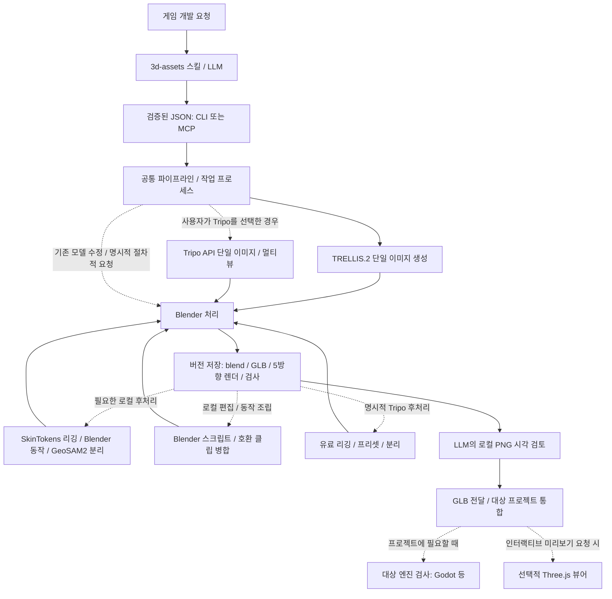

# 구성과 데이터 흐름

이 시스템은 자연어 판단과 반복 실행을 분리합니다. LLM은 참조 이미지를 준비하고 결과를 눈으로 검토하며, 런타임은 JSON에 따라 기본 TRELLIS.2 생성 또는 명시적으로 선택한 Tripo API 생성과 Blender 후처리를 실행합니다. 기본 결과는 검토한 GLB·편집 원본입니다. 대상 프로젝트의 엔진 검사와 사용자용 웹 뷰어는 선택 기능입니다.

생성 provider는 편집 방식을 결정하지 않습니다. LLM이 리그 없는 object 동작·기존 리그·SkinTokens 초안·사용자 스크립트·클립 병합을 선택하며 기본 작업은 로컬입니다. `process`는 학습된 리깅/분리와 기본 동작을 제공하고, `blender-edit`·`merge-animations`는 기존 Blender를 사용합니다. 원래 생성 출처와 이후 처리 출처는 별개로 기록합니다.



## 구현 위치

| 경로 | 역할 |
| --- | --- |
| [.agents/skills/3d-assets](../.agents/skills/3d-assets/SKILL.md) | 요청 해석·provider 선택·검토 절차와 실행 래퍼 |
| [models.py](../src/asset_auto/models.py) | 입력 스키마·필드 제한·추가 필드 거절 |
| [cli.py](../src/asset_auto/cli.py), [mcp_server.py](../src/asset_auto/mcp_server.py) | CLI·선택적 stdio MCP 진입점 |
| [jobs.py](../src/asset_auto/jobs.py) | 작업 제출, 별도 프로세스, 상태·로그 기록 |
| [pipeline.py](../src/asset_auto/pipeline.py) | 도구 호출, GPU lock, 입력 복사, 완료 기록 |
| [blender_worker.py](../src/asset_auto/blender_worker.py) | headless 모델링·수정·정규화·단순화·렌더·출력 |
| [blender_character_worker.py](../src/asset_auto/blender_character_worker.py) | 뼈·가중치·동작 보존, 공통 부모 변환, 애니메이션 샘플 렌더 |
| [authoring.py](../src/asset_auto/authoring.py) | 편집·병합 요청과 입력 사본의 해시, 완료 부모 검증과 복구 |
| [blender_authoring_worker.py](../src/asset_auto/blender_authoring_worker.py), [blender_authoring_tools.py](../src/asset_auto/blender_authoring_tools.py) | 신뢰한 로컬 스크립트 실행·authoring context·실행 완료 체크포인트 |
| [animation_merge.py](../src/asset_auto/animation_merge.py) | 기준 GLB를 보존하며 호환되는 이름 있는 클립 전송 |
| [assessment.py](../src/asset_auto/assessment.py), [motion_quality.py](../src/asset_auto/motion_quality.py), [blender_assessment_worker.py](../src/asset_auto/blender_assessment_worker.py) | 선택적 사용 조건 검사, 최종 GLB 샘플 분석·핵심 시점 렌더 |
| [usage.py](../src/asset_auto/usage.py) | GLB 해시로 묶인 명세와 편집·병합 시 이름에 맞춘 의도 상속 |
| [tripo_process.py](../src/asset_auto/tripo_process.py) | 리깅 검사·유료 후처리·단계별 원격 기록과 복구 |
| [local_process.py](../src/asset_auto/local_process.py), [local_rig.py](../src/asset_auto/local_rig.py) | 기본 로컬 후처리·원본 해시·SkinTokens 추론 |
| [local_parts.py](../src/asset_auto/local_parts.py) | 준비된 뷰·점 프롬프트·GeoSAM2 면 마스크와 원본 바인딩 |
| [blender_motion_worker.py](../src/asset_auto/blender_motion_worker.py) | 실제 뼈 매핑·절차적 IK·조밀한 바닥 검사 |
| [store.py](../src/asset_auto/store.py) | revision 생성·완료 목록·원자적 JSON 기록 |
| [godot_validate.gd](../src/asset_auto/godot_validate.gd) | GLB import 이후 장면·메시·충돌체 검사 |
| [web.py](../src/asset_auto/web.py), [web/src](../web/src/main.js) | localhost API·파일 제공 및 Three.js 렌더 |
| [bootstrap.py](../scripts/bootstrap.py) | 고정 버전 도구와 모델 다운로드 |

## 생성과 수정

기본 provider인 `trellis`는 참조 이미지로 `generated.glb`를 만들고 Blender가 후처리합니다. 이미지가 없으면 생성 요청을 거절합니다. 사용자가 명시적으로 선택한 `tripo`는 단일 이미지나 정면 포함 2–4방향 이미지를 업로드하고 원격 생성 결과를 같은 Blender 처리에 넘깁니다. 키 보유나 GPU 실패로 provider가 자동 전환되지는 않습니다. 스킬은 이미지를 Blender 도형으로 재구성하거나 import로 우회하는 대체를 금지하며, 코드도 `image`와 `procedural`·`import`를 섞은 요청을 거절합니다.

Tripo의 비용 계획은 로컬 읽기 전용이며 선택 필드 `max_credits`는 기본값 100으로 예상치만 제한합니다. 표준 생성 예상 비용은 30이며, 명시적으로 요청한 표준 생성은 추가 크레딧 확인 없이 진행합니다. 유료 제출·상태 조회·결과 다운로드를 구분하고, 원격 task ID를 revision에 저장해 알려진 작업을 다시 과금하지 않고 이어받습니다. 제출 성공 여부가 불확실하면 자동 재전송하지 않습니다. 키·입력·비용·복구 계약은 [Tripo 가이드](TRIPO.md)에 있습니다.

`procedural`은 사용자가 명시적으로 요청한 경우 이름 있는 기본 도형을 조립하는 대안입니다. `import`는 제공된 기존 GLB/Blend를 가져옵니다. 기본 정적 경로는 정규화를 위해 계층을 평탄화하며 리그·동작을 거절합니다. `asset_kind: "character"`는 리그를 요구하고, `asset_kind: "animated"`는 리그 없이도 실제 object/morph 클립을 보존합니다. 둘 다 별도 worker로 계층·동작을 유지합니다. 정적 모델 수정은 추론이나 유료 API를 다시 실행하지 않으며, 리그·동작이 있는 부모는 `blender-edit`로 변경합니다.

정적 생성·가져오기에서는 바닥 원점과 선택한 높이를 최종 단순화 이후 맞춥니다. 수정에서는 부모 revision의 `source.blend`를 읽어 새 revision을 만듭니다. 부분 변경의 배치를 유지하도록 전체 높이·원점 정규화를 다시 적용하지 않습니다. 캐릭터는 자동 감면·계층 평탄화를 하지 않습니다. 필요한 높이·바닥 정렬은 전체 메시와 armature의 공통 Empty 부모 변환으로 처리하며, 개별 메시·뼈의 상대 바인드와 동작 변환을 유지합니다.

색·거칠기 수정은 선택된 부품의 재질을 분리해 다른 부품으로 변경이 번지는 것을 막습니다. `part: "*"`의 scale도 각 오브젝트 원점 기준이므로 조립체 전체 스케일과는 다릅니다. 감면은 텍스처 재베이크가 아니며, 용접·smooth shading만으로 구멍이나 형상 결함이 해결된다고 가정하지 않습니다.

`process`는 완료된 부모의 현재 GLB 해시를 확인하고 새 revision에 `rig`·`animate`·`segment` 결과를 저장합니다. 기본 로컬 리깅은 SkinTokens 추론과 원본 메시로의 가중치 전달입니다. 로컬 애니메이션은 관찰된 뼈를 IK로 움직여 요청한 프리셋을 만들고 정확한 클립 병합으로 부모의 다른 동작을 유지합니다. 같은 캐릭터 worker가 최종 `asset.glb`를 재가져와 조밀한 시간 샘플로 바닥 침범을 검사하고, 중간·최종 검사 결과를 파일 SHA256과 함께 구분해 기록합니다. 원격 리그 ID는 필요하지 않습니다.

`blender-edit`는 완료 부모의 GLB/Blend·스크립트 사본을 `authoring-request.json`에 해시로 묶습니다. 주입한 `context`와 전체 `bpy` API를 사용하는 로컬 코드이며 샌드박스가 아닙니다. 기본값으로 기존 action을 보존하고 `authored.blend`와 실행 체크포인트를 저장한 뒤 렌더·출력합니다. 렌더 재개가 완료된 스크립트를 다시 실행하지 않도록 분리했습니다. 의도적인 object/morph 기본값 수정은 `capture_rest()`로 기록합니다.

`merge-animations`는 완료된 기준 모델과 revision/외부 GLB 사본을 검증하고 호환되는 클립만 전달합니다. 기준 기하·스킨·정지 상태를 유지하며 기본 중복 정책은 거절입니다. 다른 리그는 사용자 스크립트의 명시적인 constraint·bake 리타게팅이 필요합니다. authoring 결과는 원래 생성 출처와 구분한 `local_processing`으로 기록합니다. 사용법은 [Blender 편집](BLENDER.md)에 있습니다.

로컬 분리는 먼저 `prepare-segment`로 12개 1024px 뷰와 기하 context를 만들고 원본·context 파일 해시를 묶습니다. LLM이 해당 이미지를 보고 부품 이름과 포함·제외할 픽셀을 정하면 GeoSAM2가 학습된 마스크를 메시 면으로 전파합니다. 최종 사용자에게 annotation을 넘기지 않으며, 분류하지 못한 면도 `unclassified`로 보존합니다. 이 경로는 원본 삼각형·UV·재질·노멀·위치를 유지하고 예산 초과 시에도 감면하지 않습니다. 개별 부품 렌더를 검사하기 전까지 이름은 제안된 의미입니다. 단순 연결 성분 분리를 의미 분리의 근거로 대신하지 않습니다.

로컬 처리 출처는 `local_processing`에 기록하며 원래 생성 provider는 그대로 둡니다. 명시적 Tripo는 별도의 `remote_processing`을 사용하고, 입력 방향 변환·리그 ID·유료 단계 체크포인트를 보존합니다. 상세 필드와 provider별 제한은 [캐릭터 후처리](CHARACTERS.md)와 [Tripo 옵션](TRIPO.md#리깅애니메이션부품-분리)에 있습니다.

## 작업 상태와 품질 상태

선택적 `assess`는 최종 GLB의 사용 목적·표현 방식·동작 정책을 `usage.json`으로 기록하고, `assessment.json` 및 실행별 `assessments/q.../`에 조건부 숫자 검사·핵심 시점·누락된 검토 범위를 남깁니다. 정적 명세는 Blender를 실행하지 않습니다. 편집·병합 시 사용 조건은 선택된 클립과 이름을 따라가지만 검사·승인은 상속하지 않습니다. 한 항목의 수치 통과를 기능·시각·프로젝트 통과로 승격하지 않습니다. [품질 가이드](QUALITY.md)를 참고합니다.

| 상태/기록 | 의미 |
| --- | --- |
| 제출 응답 `submitted` | 작업 ID와 프로세스가 만들어짐 |
| 작업 `queued` / `running` | 실행 대기 또는 진행 중. GPU lock을 기다릴 수도 있음 |
| 작업 `succeeded` | 파이프라인 실행 완료. 시각 품질 승인과 별개 |
| 작업 `failed` / `interrupted` | 실행 실패 / 실행 프로세스 소실 감지 |
| manifest `numeric_checks_passed` / `needs_repair` | 수치 검사 결과 |
| `review.json` | 실제 렌더 관찰 후 기록한 시각 판단 |
| `tripo.json` | Tripo 원격 task와 출처·진행 상태, 미완료 revision에도 남음 |
| `processing.json` / 단계 체크포인트 | 후처리의 부모 요청·입력 해시와 무료 검사·유료 작업 ID |
| `local-process.json` / 로컬 backend 기록 | 요청·source/context 바인딩, 검증된 모델 출력, 로컬 추론·동작 검사 |
| `animation-previews.json` / `part-previews.json` | 실제 동작 샘플 프레임 / 개별 부품 PNG 경로 |
| `godot.json` | Godot 검사 시점의 결과 |
| `three.json` | 브라우저가 보고한 GLTFLoader·WebGL draw 결과 |

manifest의 `visual_review`, `engine_validation` 초기값은 완료 시점의 스냅샷입니다. 이후 검증의 최신 상태는 별도 sidecar에서 읽습니다. 목록/API는 review와 godot sidecar를 합쳐 보여주고, 웹은 선택한 모델의 현재 로드 결과를 직접 표시합니다.

엔진 검사를 실행하지 않아 `pending`이 남거나 sidecar가 없어도 생성 실패를 뜻하지 않습니다. 기본 LLM 검토는 수치와 로컬 PNG로 수행합니다. 새로운 모델은 5방향을 확인하고, 좁은 수정은 관련 뷰부터 확인합니다. 애니메이션은 샘플 프레임, 의미 분리는 개별 부품 PNG를 추가로 검사합니다. 런타임은 현재 매번 5방향 렌더를 생성하며, Godot·웹 프로세스는 별도 요청 명령에서만 실행합니다. 웹 뷰어에는 애니메이션 재생 제어가 없습니다.

작업 상태 파일은 재시작 후에도 남습니다. 이는 실행 중 계산을 자동으로 이어서 재개한다는 뜻이 아닙니다. 프로세스가 사라진 running 작업은 상태 조회에서 `interrupted`로 바뀝니다. 재시도 전 로그를 확인합니다. Tripo 원격 계산은 로컬 worker 종료 후에도 계속될 수 있으므로 알려진 task는 `resume-tripo`로 조회·다운로드·후처리를 이어갑니다. 완료된 revision에는 resume으로 덮어쓰지 않습니다.

후처리는 `resume-process`로 미완료 자식 revision의 저장된 provider·요청부터 이어갑니다. 로컬의 검증된 모델 출력은 재사용할 수 있지만 추론 중간에서 중단되면 계산을 다시 실행할 수 있습니다. Tripo에서는 무료·유료 task를 구분하고 알려진 작업을 중복 제출하지 않습니다. 원격 제출 성공 여부를 알 수 없는 단계는 자동 재시도하지 않습니다.

## 디스크 구조

```text
.runtime/                  도구, 모델, 다운로드 캐시, installed 출처 기록
.assets/
  jobs/<job_id>/           job.json, worker.log
  <asset_id>/<revision>/
    manifest.json         완료 마커, parent, spec, hashes, toolchain
    source.blend          편집 원본
    asset.glb             게임·웹용 GLB
    inspection.json       수치·부품·경고
    tripo.json            Tripo 사용 시 원격 task·출처·상태
    processing.json       후처리 요청과 부모 GLB 해시
    local-process.json    로컬 backend와 출력 해시·검사 기록
    animation-previews.json / part-previews.json
                          동작 샘플 / 개별 부품 PNG 목록
    front.png ...         5방향 렌더
    review.json           시각 검토 시 생성
    godot.json            Godot 검증 시 생성
    three.json            웹에서 로드·렌더 후 생성
    godot/                검증용 실제 Godot 프로젝트
.work/                    smoke 산출물, 임시 spec, 뷰어 로그
  segment-contexts/       해시로 원본과 묶인 12뷰·기하 context
.secrets/                 선택적 Tripo 키 파일, Git 제외
web/dist/                 로컬 빌드 결과
```

완료된 원본·GLB·manifest는 수정으로 덮어쓰지 않습니다. 검토 sidecar와 검증용 프로젝트는 같은 revision에서 다시 기록할 수 있습니다. 미완료 폴더는 삭제 대신 진단을 위해 남깁니다.

## 실행 범위

기본 bootstrap은 TRELLIS·가중치·Blender만 설치하며 Godot와 웹 빌드를 포함하지 않습니다. TRELLIS 추론은 CUDA, Blender 렌더는 CPU Cycles를 사용합니다. 런타임 루트별 file lock이 GPU 생성 작업을 직렬화합니다. 루트가 다르면 lock도 다릅니다. 선택한 뷰어를 실행할 때는 127.0.0.1에 바인딩하며 지정된 파일만 제공합니다. 모델 생성은 CLI/MCP 경로에서 실행됩니다.

로컬 리깅·부품 모델은 요청 시 별도 bootstrap으로 설치합니다. `.runtime/local-rig`와 `.runtime/local-parts`의 Linux/WSL Python 환경은 앱 환경과 분리되며 API 키 없이 추론합니다. 두 learned backend는 TRELLIS와 같은 GPU lock을 사용합니다. 로컬 동작은 일반 Blender를 사용하므로 추가 AI 모델이 필요하지 않습니다.

명시적 Tripo 전용 설치는 Python·Blender·키만 필요하며 로컬 CUDA와 TRELLIS 가중치를 다운로드할 필요가 없습니다. 원격 이미지 업로드와 유료 생성이 추가되지만 로컬 저장·렌더 검토·수정 규칙은 같습니다.

사용자 모션·리그/가중치 편집은 로컬 스크립트로 작성하고 호환 클립은 병합할 수 있습니다. [Kimodo](KIMODO.md)는 별도 Linux/WSL 환경에서 고정된 SOMA 모델과 로컬 텍스트 인코더를 실행하고, 기존 Blender authoring 파이프라인에서 관찰한 뼈 대응으로 모션을 적용합니다. `motion-request.json`은 입력·스크립트·모델 pin을 묶고 `kimodo-inference.json`은 재사용 가능한 모션 파일을 해시로 검증합니다. GPU 추론은 공통 TRELLIS 잠금도 사용합니다. 범용 자동 리타게팅 해법, 자동 리토폴로지·텍스처 재베이크·TRELLIS 다중 이미지 입력은 구현되어 있지 않습니다. 실제 추론·작업 성공과 변형·부품 품질은 provider에 관계없이 별도로 검사합니다.
