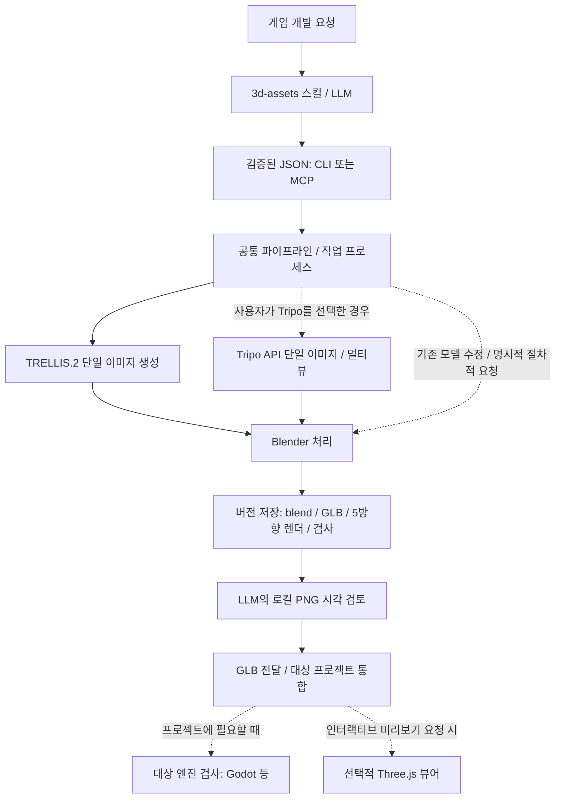

# 구성과 데이터 흐름

이 시스템은 자연어 판단과 반복 실행을 분리합니다. LLM은 참조 이미지를 준비하고 결과를 눈으로 검토하며, 런타임은 JSON에 따라 기본 TRELLIS.2 생성 또는 명시적으로 선택한 Tripo API 생성과 Blender 후처리를 실행합니다. 기본 결과는 검토한 GLB·편집 원본입니다. 대상 프로젝트의 엔진 검사와 사용자용 웹 뷰어는 선택 기능입니다.



## 구현 위치

| 경로 | 역할 |
| --- | --- |
| [.agents/skills/3d-assets](../.agents/skills/3d-assets/SKILL.md) | 요청 해석·provider 선택·검토 절차와 실행 래퍼 |
| [models.py](../src/asset_auto/models.py) | 입력 스키마·필드 제한·추가 필드 거절 |
| [cli.py](../src/asset_auto/cli.py), [mcp_server.py](../src/asset_auto/mcp_server.py) | CLI·선택적 stdio MCP 진입점 |
| [jobs.py](../src/asset_auto/jobs.py) | 작업 제출, 별도 프로세스, 상태·로그 기록 |
| [pipeline.py](../src/asset_auto/pipeline.py) | 도구 호출, GPU lock, 입력 복사, 완료 기록 |
| [blender_worker.py](../src/asset_auto/blender_worker.py) | headless 모델링·수정·정규화·단순화·렌더·출력 |
| [store.py](../src/asset_auto/store.py) | revision 생성·완료 목록·원자적 JSON 기록 |
| [godot_validate.gd](../src/asset_auto/godot_validate.gd) | GLB import 이후 장면·메시·충돌체 검사 |
| [web.py](../src/asset_auto/web.py), [web/src](../web/src/main.js) | localhost API·파일 제공 및 Three.js 렌더 |
| [bootstrap.py](../scripts/bootstrap.py) | 고정 버전 도구와 모델 다운로드 |

## 생성과 수정

기본 provider인 `trellis`는 참조 이미지로 `generated.glb`를 만들고 Blender가 후처리합니다. 이미지가 없으면 생성 요청을 거절합니다. 사용자가 명시적으로 선택한 `tripo`는 단일 이미지나 정면 포함 2–4방향 이미지를 업로드하고 원격 생성 결과를 같은 Blender 처리에 넘깁니다. 키 보유나 GPU 실패로 provider가 자동 전환되지는 않습니다. 스킬은 이미지를 Blender 도형으로 재구성하거나 import로 우회하는 대체를 금지하며, 코드도 `image`와 `procedural`·`import`를 섞은 요청을 거절합니다.

Tripo의 비용 계획은 로컬 읽기 전용이며 선택 필드 `max_credits`는 기본값 100으로 예상치만 제한합니다. 표준 생성 예상 비용은 30이며, 명시적으로 요청한 표준 생성은 추가 크레딧 확인 없이 진행합니다. 유료 제출·상태 조회·결과 다운로드를 구분하고, 원격 task ID를 revision에 저장해 알려진 작업을 다시 과금하지 않고 이어받습니다. 제출 성공 여부가 불확실하면 자동 재전송하지 않습니다. 키·입력·비용·복구 계약은 [Tripo 가이드](TRIPO.md)에 있습니다.

`procedural`은 사용자가 명시적으로 요청한 경우 이름 있는 기본 도형을 조립하는 대안입니다. `import`는 제공된 기존 정적 GLB/Blend를 가져옵니다. 기존 모델 수정은 추론이나 유료 API를 다시 실행하지 않습니다. 가져온 정적 계층은 정규화를 위해 평탄화되며 armature는 거절합니다.

생성·가져오기에서는 바닥 원점과 선택한 높이를 최종 단순화 이후 맞춥니다. 수정에서는 부모 revision의 `source.blend`를 읽어 새 revision을 만듭니다. 부분 변경의 배치를 유지하도록 전체 높이·원점 정규화를 다시 적용하지 않습니다.

색·거칠기 수정은 선택된 부품의 재질을 분리해 다른 부품으로 변경이 번지는 것을 막습니다. `part: "*"`의 scale도 각 오브젝트 원점 기준이므로 조립체 전체 스케일과는 다릅니다. 감면은 텍스처 재베이크가 아니며, 용접·smooth shading만으로 구멍이나 형상 결함이 해결된다고 가정하지 않습니다.

## 작업 상태와 품질 상태

| 상태/기록 | 의미 |
| --- | --- |
| 제출 응답 `submitted` | 작업 ID와 프로세스가 만들어짐 |
| 작업 `queued` / `running` | 실행 대기 또는 진행 중. GPU lock을 기다릴 수도 있음 |
| 작업 `succeeded` | 파이프라인 실행 완료. 시각 품질 승인과 별개 |
| 작업 `failed` / `interrupted` | 실행 실패 / 실행 프로세스 소실 감지 |
| manifest `numeric_checks_passed` / `needs_repair` | 수치 검사 결과 |
| `review.json` | 실제 렌더 관찰 후 기록한 시각 판단 |
| `tripo.json` | Tripo 원격 task와 출처·진행 상태, 미완료 revision에도 남음 |
| `godot.json` | Godot 검사 시점의 결과 |
| `three.json` | 브라우저가 보고한 GLTFLoader·WebGL draw 결과 |

manifest의 `visual_review`, `engine_validation` 초기값은 완료 시점의 스냅샷입니다. 이후 검증의 최신 상태는 별도 sidecar에서 읽습니다. 목록/API는 review와 godot sidecar를 합쳐 보여주고, 웹은 선택한 모델의 현재 로드 결과를 직접 표시합니다.

엔진 검사를 실행하지 않아 `pending`이 남거나 sidecar가 없어도 생성 실패를 뜻하지 않습니다. 기본 LLM 검토는 수치와 로컬 PNG로 수행합니다. 새로운 모델은 5방향을 확인하고, 좁은 수정은 관련 뷰부터 확인합니다. 런타임은 현재 매번 5방향 렌더를 생성하며, Godot·웹 프로세스는 별도 요청 명령에서만 실행합니다.

작업 상태 파일은 재시작 후에도 남습니다. 이는 실행 중 계산을 자동으로 이어서 재개한다는 뜻이 아닙니다. 프로세스가 사라진 running 작업은 상태 조회에서 `interrupted`로 바뀝니다. 재시도 전 로그를 확인합니다. Tripo 원격 계산은 로컬 worker 종료 후에도 계속될 수 있으므로 알려진 task는 `resume-tripo`로 조회·다운로드·후처리를 이어갑니다. 완료된 revision에는 resume으로 덮어쓰지 않습니다.

## 디스크 구조

```text
.runtime/                  도구, 모델, 다운로드 캐시, installed 출처 기록
.assets/
  jobs/<job_id>/           job.json, worker.log
  <asset_id>/<revision>/
    manifest.json         완료 마커, parent, spec, hashes, toolchain
    source.blend          편집 원본
    asset.glb             게임·웹용 GLB
    inspection.json       수치·부품·경고
    tripo.json            Tripo 사용 시 원격 task·출처·상태
    front.png ...         5방향 렌더
    review.json           시각 검토 시 생성
    godot.json            Godot 검증 시 생성
    three.json            웹에서 로드·렌더 후 생성
    godot/                검증용 실제 Godot 프로젝트
.work/                    smoke 산출물, 임시 spec, 뷰어 로그
.secrets/                 선택적 Tripo 키 파일, Git 제외
web/dist/                 로컬 빌드 결과
```

완료된 원본·GLB·manifest는 수정으로 덮어쓰지 않습니다. 검토 sidecar와 검증용 프로젝트는 같은 revision에서 다시 기록할 수 있습니다. 미완료 폴더는 삭제 대신 진단을 위해 남깁니다.

## 실행 범위

기본 bootstrap은 TRELLIS·가중치·Blender만 설치하며 Godot와 웹 빌드를 포함하지 않습니다. TRELLIS 추론은 CUDA, Blender 렌더는 CPU Cycles를 사용합니다. 런타임 루트별 file lock이 GPU 생성 작업을 직렬화합니다. 루트가 다르면 lock도 다릅니다. 선택한 뷰어를 실행할 때는 127.0.0.1에 바인딩하며 지정된 파일만 제공합니다. 모델 생성은 CLI/MCP 경로에서 실행됩니다.

명시적 Tripo 전용 설치는 Python·Blender·키만 필요하며 로컬 CUDA와 TRELLIS 가중치를 다운로드할 필요가 없습니다. 원격 이미지 업로드와 유료 생성이 추가되지만 로컬 저장·렌더 검토·수정 규칙은 같습니다.

리깅·애니메이션용 리토폴로지·TRELLIS 다중 이미지 입력은 아직 구현되어 있지 않습니다. Tripo 멀티뷰 지원이 기존 정적 메시 제약이나 의미 부품 분리의 한계를 없애지는 않습니다.
