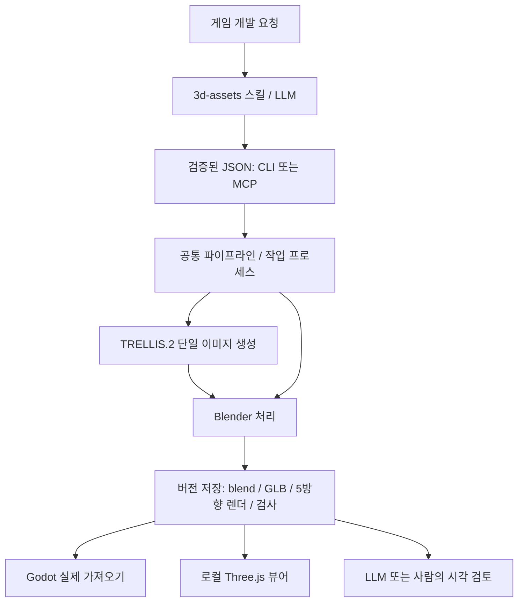

# 구성과 데이터 흐름

이 시스템은 자연어 판단과 반복 실행을 분리합니다. LLM은 요청을 구체화하고 결과를 눈으로 검토하며, 런타임은 정해진 JSON을 받아 생성·수정·검사·저장을 수행합니다.



## 구현 위치

| 경로 | 역할 |
| --- | --- |
| [.agents/skills/3d-assets](../.agents/skills/3d-assets/SKILL.md) | 요청 해석·provider 선택·검토 절차와 실행 래퍼 |
| [models.py](../src/asset_auto/models.py) | 입력 스키마·필드 제한·추가 필드 거절 |
| [cli.py](../src/asset_auto/cli.py), [mcp_server.py](../src/asset_auto/mcp_server.py) | CLI·선택적 stdio MCP 진입점 |
| [jobs.py](../src/asset_auto/jobs.py) | 작업 제출, 별도 프로세스, 상태·로그 기록 |
| [pipeline.py](../src/asset_auto/pipeline.py) | 도구 호출, GPU lock, 입력 복사, 완료 기록 |
| [blender_worker.py](../src/asset_auto/blender_worker.py) | headless 모델링·수정·정규화·단순화·렌더·출력 |
| [store.py](../src/asset_auto/store.py) | revision 생성·완료 목록·원자적 JSON 기록 |
| [godot_validate.gd](../src/asset_auto/godot_validate.gd) | GLB import 이후 장면·메시·충돌체 검사 |
| [web.py](../src/asset_auto/web.py), [web/src](../web/src/main.js) | localhost API·파일 제공 및 Three.js 렌더 |
| [bootstrap.py](../scripts/bootstrap.py) | 고정 버전 도구와 모델 다운로드 |

## 생성과 수정

`procedural`은 이름 있는 기본 도형을 조립합니다. `trellis`는 참조 이미지로 `generated.glb`를 만들고 Blender가 후처리합니다. `import`는 기존 정적 GLB/Blend를 가져옵니다. 가져온 정적 계층은 정규화를 위해 평탄화되며 armature는 거절합니다.

생성·가져오기에서는 바닥 원점과 선택한 높이를 최종 단순화 이후 맞춥니다. 수정에서는 부모 revision의 `source.blend`를 읽어 새 revision을 만듭니다. 부분 변경의 배치를 유지하도록 전체 높이·원점 정규화를 다시 적용하지 않습니다.

색·거칠기 수정은 선택된 부품의 재질을 분리해 다른 부품으로 변경이 번지는 것을 막습니다. `part: "*"`의 scale도 각 오브젝트 원점 기준이므로 조립체 전체 스케일과는 다릅니다. 감면은 텍스처 재베이크가 아니며, 용접·smooth shading만으로 구멍이나 형상 결함이 해결된다고 가정하지 않습니다.

## 작업 상태와 품질 상태

| 상태/기록 | 의미 |
| --- | --- |
| 제출 응답 `submitted` | 작업 ID와 프로세스가 만들어짐 |
| 작업 `queued` / `running` | 실행 대기 또는 진행 중. GPU lock을 기다릴 수도 있음 |
| 작업 `succeeded` | 파이프라인 실행 완료. 시각 품질 승인과 별개 |
| 작업 `failed` / `interrupted` | 실행 실패 / 실행 프로세스 소실 감지 |
| manifest `numeric_checks_passed` / `needs_repair` | 수치 검사 결과 |
| `review.json` | 실제 렌더 관찰 후 기록한 시각 판단 |
| `godot.json` | Godot 검사 시점의 결과 |
| `three.json` | 브라우저가 보고한 GLTFLoader·WebGL draw 결과 |

manifest의 `visual_review`, `engine_validation` 초기값은 완료 시점의 스냅샷입니다. 이후 검증의 최신 상태는 별도 sidecar에서 읽습니다. 목록/API는 review와 godot sidecar를 합쳐 보여주고, 웹은 선택한 모델의 현재 로드 결과를 직접 표시합니다.

작업 상태 파일은 재시작 후에도 남습니다. 이는 실행 중 계산을 자동으로 이어서 재개한다는 뜻이 아닙니다. 프로세스가 사라진 running 작업은 상태 조회에서 `interrupted`로 바뀝니다. 재시도 전 로그를 확인합니다.

## 디스크 구조

```text
.runtime/                  도구, 모델, 다운로드 캐시, installed 출처 기록
.assets/
  jobs/<job_id>/           job.json, worker.log
  <asset_id>/<revision>/
    manifest.json         완료 마커, parent, spec, hashes, toolchain
    source.blend          편집 원본
    asset.glb             게임·웹용 GLB
    inspection.json       수치·부품·경고
    front.png ...         5방향 렌더
    review.json           시각 검토 시 생성
    godot.json            Godot 검증 시 생성
    three.json            웹에서 로드·렌더 후 생성
    godot/                검증용 실제 Godot 프로젝트
.work/                    smoke 산출물, 임시 spec, 뷰어 로그
web/dist/                 로컬 빌드 결과
```

완료된 원본·GLB·manifest는 수정으로 덮어쓰지 않습니다. 검토 sidecar와 검증용 프로젝트는 같은 revision에서 다시 기록할 수 있습니다. 미완료 폴더는 삭제 대신 진단을 위해 남깁니다.

## 실행 범위

TRELLIS 추론은 CUDA, Blender 렌더는 CPU Cycles를 사용합니다. 런타임 루트별 file lock이 GPU 생성 작업을 직렬화합니다. 루트가 다르면 lock도 다릅니다. 뷰어는 127.0.0.1에 바인딩하며 지정된 에셋 파일만 제공합니다. 모델 생성은 CLI/MCP 경로에서 실행됩니다.

앞으로 리깅·리토폴로지·다중 이미지 입력을 추가하려면 기존 정적 입력 규칙을 우회하는 대신 지원 여부와 전용 검사 기준부터 추가해야 합니다. 현재 코드에는 해당 기능의 구현이나 다운로드 경로가 없습니다.
